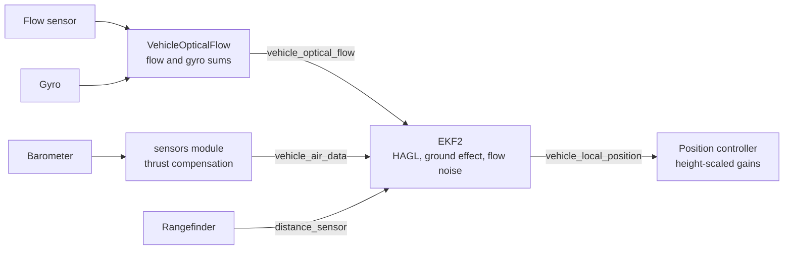

# [RFC] Improve optical flow velocity and position hold

Status: draft, not authoritative. This RFC is a living document. It changes as flight data comes in, and nothing in it is decided yet.

## Summary

This RFC describes what limits optical flow navigation in PX4 today and proposes an order in which to fix it. It matters most for vehicles that hold position on flow alone, and for flight above a few metres, where every error in flow velocity grows with height.

The proposal makes the following changes:

1. The sensors module corrects the barometer for thrust, and EKF2 detects ground effect from measured height, so height above ground stays accurate when the rangefinder isn't fused.
2. `VehicleOpticalFlow` pairs every flow sample with a gyro sum over exactly the same time, and drops a sample without one.
3. EKF2 fuses only frames the sensor actually tracked, and weights them by the sensor's raw tracking quality.
4. EKF2's flow noise accounts for the sensor's resolution, the sample's length, and the vehicle's rotation rate.
5. The position controller reduces its horizontal gains as height grows when flow is the only horizontal aid.

Driver fixes for items 2 and 3 are in review as [#28632 fix(optical_flow): avoid resetting on poor tracking quality](https://github.com/PX4/PX4-Autopilot/pull/28632).

Background notes: [Optical flow performance vs altitude](https://github.com/dakejahl/botenook/blob/main/optical_flow/performance_vs_altitude.md) covers the sensor limits and the noise model, and [Rangefinder altitude and terrain estimation](https://github.com/dakejahl/botenook/blob/main/rangefinder/altitude_and_terrain_estimation.md) covers how EKF2 uses the barometer and rangefinder for height. The flight data comes from [dakejahl/PX4-Autopilot#58 feat(optical_flow): add raw capture for GNSS comparison](https://github.com/dakejahl/PX4-Autopilot/pull/58), which logs every flow frame from an ARK Flow MR and compares it with GNSS velocity.

## Terms

- **Flow sensor**: a downward-facing camera chip that reports how far the image moved since the last read. ARK Flow uses the PixArt PAW3902, and ARK Flow MR uses the PAA3905.
- **Count**: the smallest image movement the sensor reports. One count is 2.13 mrad of angle.
- **Flow rate**: image movement per second, in rad/s. It contains both the vehicle's rotation and its movement over the ground.
- **Gyro compensation**: subtracting the rotation that the gyro measured from the flow rate, which leaves the part caused by movement.
- **HAGL**: height above ground level. EKF2 estimates it as the distance between its terrain state and its altitude.
- **Window**: the time span that one flow sample covers. The flow and gyro sums for a sample must cover the same window.
- **SQUAL**: the number of image features the PixArt chip tracks in a frame. Drivers publish it, or a value derived from it, as the sample's quality.
- **Thrust error**: a barometer error caused by propeller wash, which changes the static pressure at the sensor as thrust changes.
- **Ground effect**: a barometer error near the ground, where rotor wash reflects off the surface.

## Problems

Flow gives velocity as the product of two estimates:

`velocity = (flow rate − rotation rate) × HAGL`

An error in either factor becomes a velocity error, and every error in the first factor is multiplied by height.

### HAGL falls back to the barometer

While the rangefinder is fused, the terrain state follows it and HAGL is accurate. In test flights up to 12 m, replacing EKF2's HAGL with the raw range changed the velocity error by less than 0.1 m/s.

When the rangefinder isn't fused, the terrain state keeps its last value, and HAGL moves with EKF2's altitude. Without GNSS, the barometer is the height reference, and EKF2 estimates no bias for its height reference. HAGL then follows every barometer error. This happens in the following cases:

- Above the rangefinder's reach. In daylight over pavement, the ARK Flow MR's rangefinder reaches 13 to 21 m, depending on its measurement profile.
- During dropouts. In four of five test flights, the rangefinder reported invalid data on 22 to 31 % of airborne samples between 1.4 and 4.5 m.
- When the range fails EKF2's consistency check. The check compares how fast the range changes with EKF2's vertical velocity, which partly comes from the barometer.

A HAGL error scales every velocity by the same fraction. A 2 m error at 10 m makes every velocity 20 % wrong.

### The barometer is wrong under thrust and near the ground

The following two errors are largest where flow vehicles fly:

- **Thrust error.** On an ARK FPV flight controller with a BMP390, altitude error followed thrust with a correlation of 0.91 and reached about 7 m, as reported in [#26924 feat(sensors): barometer thrust compensation with online estimator](https://github.com/PX4/PX4-Autopilot/pull/26924). PX4 has no thrust compensation. The `EKF2_PCOEF_*` static pressure compensation needs a wind estimate, which a multicopter doesn't have by default.
- **Ground effect.** EKF2 sets its ground effect flag when HAGL is below `EKF2_GND_MAX_HGT` (0.5 m), or from the land detector when HAGL is invalid. While the flag is set, EKF2 ignores negative barometer innovations up to `EKF2_GND_EFF_DZ` (4 m). This assumes one direction of error, but the direction depends on where the barometer sits on the airframe. In 15 of 20 public logs, the takeoff error had the other sign, with peaks near 4 m, as reported in [#26655 fix(ekf2): apply baro ground effect deadzone symmetrically](https://github.com/PX4/PX4-Autopilot/pull/26655).

The ground effect flag also depends on HAGL, which the barometer corrupts when the rangefinder isn't fused. At takeoff, both errors appear at once, because thrust rises as the vehicle leaves the ground.

### Gyro errors grow with height

The flow sensor sees the vehicle's rotation and its movement at the same time. At height, the movement part is small. At 12 m in a test flight, one frame held 2.7 mrad of rotation and 1.6 mrad of movement. Velocity is then the small difference between two larger numbers. An error of 0.01 rad/s in that difference is 2 cm/s at 2 m and 20 cm/s at 20 m.

Test flights with an ARK Flow MR found these errors:

- **Vibration.** The flow node's gyro read 1 rad/s RMS in pitch, against 0.2 rad/s on the flight controller. [#28624 feat(invensense): board-selectable anti-alias bandwidth for CAN flow nodes](https://github.com/PX4/PX4-Autopilot/pull/28624) fixed this with an anti-alias filter on the node's IMU.
- **Mismatched windows.** The driver sometimes read the same frame twice and paired the image movement with the next frame's gyro sum. This affected 585 of 1331 reads in one night flight. The node's gyro buffer could also cover less than half of a long window. #28632 fixes both.
- **Chip errors during rotation.** After a pitch and roll at 12 m, the chip reported 115 counts where the gyro and attitude predicted 27. That one second carried 6.55 m/s of error, while the other 13 seconds averaged 0.66 m/s. `VehicleOpticalFlow` passed the sample through.

Two more gaps are visible in the code:

- If no gyro samples cover a window, `VehicleOpticalFlow` publishes the flow without compensation.
- The DroneCAN flow message has no timestamp. The flight controller stamps each sample when it arrives, and `EKF2_OF_DELAY` (7 ms) stands in for the transport delay.

### Resolution coarsens with height

The sensor's resolution is fixed in angle. On the ground, one count covers a distance that grows with height, and the smallest velocity step a sample can show depends on its window. The following table shows both:

| HAGL | Ground distance per count | Velocity step, 20 ms window | Velocity step, 100 ms window |
|---|---|---|---|
| 2 m | 4.3 mm | 0.21 m/s | 0.04 m/s |
| 10 m | 2.1 cm | 1.07 m/s | 0.21 m/s |
| 20 m | 4.3 cm | 2.13 m/s | 0.43 m/s |

A slow drift at height is mostly invisible. At 20 m, a drift of 0.3 m/s moves the image by one count every 143 ms, so most samples show zero and EKF2 gets a correction only when a count arrives. Users report slow drift and a rolling oscillation at 20 m, which fits this picture.

A longer window makes the step finer. The sensors module sums frames at a fixed rate, `SENS_FLOW_RATE` (70 Hz), at every height.

### EKF2 fuses frames the sensor can't track

Below a SQUAL of about 85, the PAA3905 stops tracking reliably. Between SQUAL 60 and 85, it reported 50 to 80 % of the true movement over grass and 30 to 60 % over pavement. Below 60, its output was noise. Over grass at 2 m, most frames fall between 60 and 78.

EKF2 accepts every frame with a quality of at least `EKF2_OF_QMIN` (1). In a daylight flight over pavement, EKF2 fused 95 % of samples, and their velocity correlated 0.28 with EKF2's own.

Two more problems make this worse:

- [#28625 fix(optical_flow): normalize PixArt SQUAL onto the 0-255 quality contract](https://github.com/PX4/PX4-Autopilot/pull/28625) maps each camera mode's noise floor to quality 0. The tracking limit sits at the same raw SQUAL in every mode, so after mapping it becomes quality 67 in bright light and 1 in the darkest mode. No single `EKF2_OF_QMIN` separates good frames from bad.
- Before #28632, the drivers treated low SQUAL as a hardware failure and reset the chip. In a 102 s night flight, the driver reset 72 times and delivered no flow for 66 s.

### The noise model ignores window length and rotation

EKF2 sets the assumed noise of each flow sample from its quality alone. The noise ramps from `EKF2_OF_N_MAX` at `EKF2_OF_QMIN` to `EKF2_OF_N_MIN` at quality 255. This model has the following gaps:

- The noise doesn't shrink as the window grows, although quantization noise does. A long window gets the same weight as a short one.
- The noise doesn't grow with rotation rate, although compensation errors do.
- The ramp ends at quality 255, but raw SQUAL rarely exceeds 120, so good frames get close to the worst-case noise.
- EKF2 treats errors in consecutive samples as independent. Measured errors have a lag-1 autocorrelation of 0.8, so EKF2 is more confident than the data supports.

### Position control doesn't account for height

When flow is the only horizontal aid, EKF2 publishes a speed limit, `vxy_max`, equal to half the sensor's maximum flow rate times HAGL. That is about 4 m/s per metre of height. The limit grows with height, and so does the smallest velocity step that flow resolves. Nothing reduces the position controller's gains at height. The same flow error is a velocity error ten times larger at 20 m than at 2 m, and the controller responds to it with the same gain.

Near the ground, the same limit is too tight. At 0.3 m, manual flight is limited to 1.2 m/s, as reported in [#26786 fix(flight_mode_manager): remove optical flow velocity constraint in manual modes](https://github.com/PX4/PX4-Autopilot/pull/26786).

ArduPilot has scaled its horizontal velocity gains by 4 / max(HAGL, 4) during flow flight since 2014.

## Proposal

The following diagram shows where each change sits:

On ARK Flow and ARK Flow MR, the flow sensor, its gyro, and a first `VehicleOpticalFlow` run on the flow node, which sends the sums over DroneCAN.

### Compensate the barometer for thrust

The sensors module corrects each barometer for thrust before EKF2 uses it:

- The correction is linear in thrust, with one coefficient per barometer. [#27885 feat(sensors): barometer thrust compensation](https://github.com/PX4/PX4-Autopilot/pull/27885) continues #26924 in this form and moves the `EKF2_PCOEF_*` compensation into the sensors module with it.
- Thrust is divided by the hover thrust estimate, so battery sag doesn't look like a pressure change.
- A calibration flight finds the coefficient. The flight includes climbs and descents, because hover alone doesn't change thrust enough.
- A fixed, calibrated coefficient comes first. An online estimator can follow.

This follows the other barometer corrections, such as thermal compensation, which the sensors module applies before EKF2. ArduPilot added the same linear correction in [ArduPilot/ardupilot#28982 Baro thrust scaling](https://github.com/ArduPilot/ardupilot/pull/28982).

### Detect ground effect from measured height

Ground effect handling uses height that the rangefinder measures, not estimated HAGL:

- The flag is set while the measured range is below a threshold. Without a valid range, the land detector sets it at takeoff and landing.
- The flag holds through short rangefinder dropouts, and a timeout clears it, so a stuck flag can't disable the barometer for long.
- While the flag is set, EKF2 reduces the barometer's weight for errors in both directions.
- The barometer bias estimate doesn't learn while the flag is set.

The direction of the error depends on the airframe, so a one-sided gate is wrong on most vehicles. Measured height avoids the loop in which the barometer corrupts the HAGL that decides whether to trust the barometer. ArduPilot bounds its takeoff flag with a height gate and a timeout in [ArduPilot/ardupilot#32472 Copter: add ground effect altitude and timeout parameters](https://github.com/ArduPilot/ardupilot/pull/32472).

### Keep the rangefinder fused

Whenever the rangefinder is fused, HAGL doesn't depend on the barometer. The work includes these items:

- a fix for the rangefinder dropouts at low height, once their cause is known
- a configured rangefinder maximum that matches what the sensor measures in daylight
- a height ceiling inside the rangefinder's reach when flow is the only horizontal aid, so the vehicle doesn't climb into barometer-only HAGL

The dropouts seen so far happen below 5 m, where thrust error and ground effect are largest, so each one hands HAGL to the barometer when the barometer is least accurate.

### Give every flow sample its own gyro sum

The flow and gyro sums of a sample cover exactly the same window:

- The driver never reads a frame twice, and a timeout read never takes part of the next frame's window. #28632 does this.
- The gyro buffer covers the whole window at the node's gyro rate. #28632 does this.
- A window without full gyro coverage is dropped instead of published without compensation.
- DroneCAN flow carries the node's sample time, mapped through the bus time base as other DroneCAN sensors have been since [#28176 fix(uavcan): publish UNKNOWN node timestamps until time-synced and map them through the bus time base on the FC](https://github.com/PX4/PX4-Autopilot/pull/28176).

At height, the rotation part of a frame is larger than the movement part, so any error in the gyro sum shows up at full size in the velocity.

### Gate and weight frames by raw SQUAL

Quality is the chip's raw SQUAL, and EKF2 fuses only frames above a tracking floor:

- The drivers publish raw SQUAL in every camera mode.
- A frame below the floor is published as blind, with quality 0, over its own window. `VehicleOpticalFlow` keeps blind time out of the flow and gyro sums.
- A frame below the floor doesn't reset the chip.
- `EKF2_OF_QMIN` sits at the floor, and the noise ramp ends at a new `EKF2_OF_QMAX` instead of 255.

#28632 does all of this. Everything except the final floor of 60 has flown. Frames between 60 and 85 still under-report movement, so the floor trades coverage for accuracy. Over grass at 2 m, a floor of 85 marked 73 % of windows blind in flight. An offline rebuild of the same flight with a floor of 60 kept 97 % of windows, at 1.1 m/s RMS error against GNSS.

### Add resolution, window length, and rotation to the noise model

EKF2's flow noise combines three terms:

- the quality term, as today
- a quantization term: the sensor's resolution divided by the window length. The resolution travels with each sample in a new `sensor_optical_flow` field
- a rotation term that grows with the body rate

With quantization in the model, a longer window earns more weight without retuning. The window can then grow with height, so each sample covers a similar distance on the ground: short near the ground for fast response, and longer at height, where one count covers several centimetres.

### Scale position control with height

When flow is the only horizontal aid, the position controller reduces its horizontal gains as HAGL grows:

- EKF2 publishes a gain scale in `vehicle_local_position`, next to `vxy_max`. The position controller applies it to the horizontal velocity loop.
- The speed limit subtracts a margin for rotation from the maximum flow rate before it scales with HAGL.
- Manual modes get a usable speed near the ground. Review of #26786 preferred raising the minimum speed limit over removing the scaling.

Flow's velocity noise grows with height, and a fixed gain turns that noise into attitude motion. [ArduPilot/ardupilot#33569 AP_NavEKF3: make the optical-flow nav gain detune height configurable (EK3_FLOW_GAIN_H)](https://github.com/ArduPilot/ardupilot/pull/33569) makes the height of ArduPilot's scale configurable.

## Compatibility

This proposal changes behavior and interfaces:

- **Quality.** Raw SQUAL replaces the per-mode quality from #28625. The flow node computes quality and the flight controller's `EKF2_OF_QMIN` interprets it, so both must run matching firmware. ARK's `release_ark` branch already sends raw SQUAL.
- **Parameters.** `EKF2_OF_QMIN`, `EKF2_OF_N_MIN`, and `EKF2_OF_N_MAX` change defaults, and `EKF2_OF_QMAX` is new. Stored values override the new defaults and need a reset. #27885 renames `EKF2_PCOEF_*` to `SENS_BARO_K_*`. `EKF2_GND_EFF_DZ` and `EKF2_GND_MAX_HGT` change meaning or go away.
- **Messages.** `sensor_optical_flow` gains a resolution field. A timestamp on DroneCAN flow needs a new or extended DroneCAN message.
- **Open PRs.** [#28000 feat(ekf2): support up to two optical flow sensors](https://github.com/PX4/PX4-Autopilot/pull/28000) moves per-sensor flow parameters into the sensors module. The noise model changes here follow the same split.

## Rollout

The work lands in this order:

1. Driver fixes and the raw SQUAL gate: #28632, in draft.
2. Barometer thrust compensation: #27885.
3. Ground effect detection from measured height. #26655 was closed to wait for step 2.
4. Rangefinder availability: low-height dropouts, range limits, and the height ceiling.
5. Gyro sums: dropped windows without gyro coverage, and a timestamp on DroneCAN flow.
6. The noise model, then a window that grows with height.
7. Height-scaled position control and speed limits.

Step 1 is already written and doesn't depend on the others. Steps 2 to 4 come next because every later result is scaled by HAGL: tuning the noise model or the controller on a HAGL that is 20 % wrong fits the tuning to the error. Thrust compensation comes before ground effect because both errors appear together at takeoff, and the ground effect gate can't be sized until the thrust error is gone. Step 5 doesn't depend on steps 2 to 4 and can land alongside them.

## Alternatives considered

- **Use the rangefinder as the height reference.** With `EKF2_HGT_REF` set to range, HAGL doesn't depend on the barometer while the range is valid. But EKF2 doesn't check its height reference against other sensors, so altitude follows the ground, and above the range the vehicle has no height reference at all.
- **Retune `EKF2_OF_N_MIN` and `EKF2_OF_N_MAX`.** [#25365 EKF2: adjust min and max noise of OF-data](https://github.com/PX4/PX4-Autopilot/pull/25365) proposed new defaults and closed without flight results. No single pair fits every window length, height, and rotation rate, because the real noise depends on all three.
- **Compensate with the flight controller's gyro.** In test flights, using the flight controller's gyro instead of the node's changed the velocity error by at most 0.05 m/s. The node's gyro moves with the camera, which matters where the mount flexes: the node's pitch axis moved independently of the flight controller above about 4 Hz.
- **Normalize SQUAL per camera mode.** #28625 did this. The tracking limit sits at the same raw SQUAL in every mode, so normalization moves it to a different quality in each mode.
- **Apply the ground effect deadzone in both directions.** #26655 did this. It hides the barometer after every flag instead of removing the error, and it can't tell ground effect from thrust error.

## Feedback requested

1. **A separate height filter for flow.** [ArduPilot/ardupilot#32389 AP_NavEKF3: add 2-state IMU-aided AGL Kalman filter for optical flow](https://github.com/ArduPilot/ardupilot/pull/32389) scales flow with a small filter fed by the rangefinder, so barometer errors in the main filter don't reach flow velocity. EKF2 already has a terrain state. Does a separate filter add enough to be worth a second height estimate?
2. **Thrust on tilting airframes.** On tailsitters and tiltrotors, `thrust_z` includes forward thrust. Should the correction use thrust along the barometer's axis, or should it apply only to multicopters at first?
3. **Where the window is chosen.** The sensors module sums flow at a fixed rate, but a window that grows with height needs HAGL, which EKF2 owns. Should EKF2 sum flow itself?
4. **Ground effect response.** The options are a two-sided deadzone, a larger barometer noise, or pausing barometer fusion. Which one keeps altitude hold stable at takeoff without hiding a real climb?
5. **Correlated errors.** Consecutive flow errors are strongly correlated. Is a lower fusion rate enough, or does EKF2 need a flow error state, as proposed for GNSS in [GNSS coloured position error and EKF bias states](https://github.com/dakejahl/botenook/blob/main/gnss/ekf_position_bias.md)?

## Measurements still needed

- A flight above 16 m with flow fused. No log exists yet.
- A flight with flow fused while the rangefinder is invalid. The effect of barometer error on flow velocity is derived, not measured.
- Whether thrust changes cause the rangefinder to fail EKF2's consistency check.
- The cause of the rolling oscillation at height. The link to resolution and control gain is derived, not reproduced.
- The cause of the rangefinder dropouts between 1.4 and 4.5 m.
- Whether the chip keeps movement smaller than one count between reads. Below one count per frame, it reported 85 to 87 % of the expected movement, against 93 to 100 % at two to five counts per frame.
- The PAW3902's tracking limit. Almost no ARK Flow data exists.
- The thrust coefficient across airframes and air densities.

## Future work

- **Flow without a rangefinder.** Flow can't start as the only aid without a valid HAGL. A drag model or a thrust-corrected barometer could provide one.
- **Terrain steps.** [#27110 Rangefinder step-changes cause altitude jumps in Terrain Hold with optical flow](https://github.com/PX4/PX4-Autopilot/issues/27110) tracks altitude jumps when the ground under the vehicle steps.
- **Altitude semantics.** [#27330 \[RFC\] EKF2 altitude semantics for Flow+Range and Multi-EKF](https://github.com/PX4/PX4-Autopilot/issues/27330) covers which sensor defines altitude. This RFC doesn't change that.
- **In-flight scale calibration.** ArduPilot fits the flow scale while the pilot rocks the vehicle in roll and pitch. PX4 has only `SENS_FLOW_SCALE`.
- **Flow in simulation.** [#28270 feat(SIH): Added optical flow sensor](https://github.com/PX4/PX4-Autopilot/pull/28270) adds flow to SIH, which allows regression tests for the noise model and control changes.
- **Flow logging.** The default profile logs the flow aid source and `vehicle_optical_flow` at 2 Hz, too slow to diagnose flow problems from a customer log.
- **Chip state over DroneCAN.** [dakejahl/PX4-Autopilot#49 uavcannode: add FlowMeasurementAux for ARK Flow / Flow MR diagnostics](https://github.com/dakejahl/PX4-Autopilot/pull/49) sends the camera mode, shutter, and rejected-frame counts.
